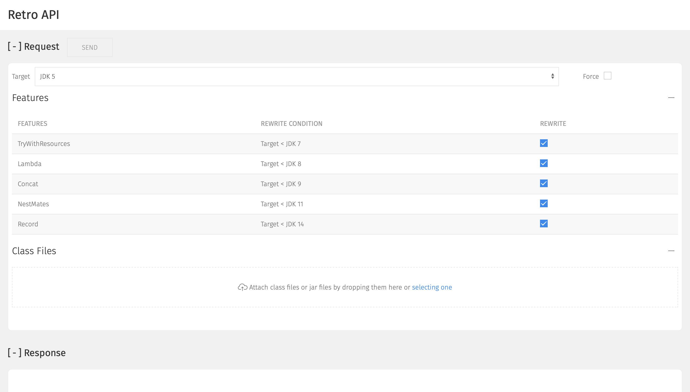

# Retro
A Java program to downgrade Java bytecode to an older Java version than the compilation version while keeping the features.

## Requirements

- [JDK 13](https://www.oracle.com/java/technologies/javase-downloads.html)
- [Quarkus](https://quarkus.io/)
- [Maven](https://maven.apache.org/)

## Doc

[doc/rapport.pdf](doc/rapport.pdf)

## Usage

### Command Line


```
java -jar retro.jar [option] files

where options include:

    -target 
        target JDK version >= 5
    
    --force 
        force mode
    
    -features <A , separated list of the following features TryWithResources, Lambda, Concat, NestMates, Record>
                if not specified the program will search all features 
   
    -info 
        print informative messages
        
    -help 
        print help
        
The program will not modify the original files and will output the result in a subfolder "retro-output"
```

### Web

* Launch [quarkus](https://quarkus.io) dev server

```sh
./scripts/quarkus-dev.sh
```

* Open the browser at <http://0.0.0.0:8080>


