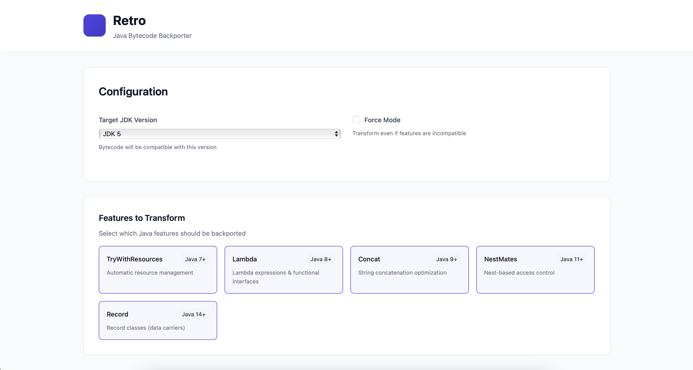

# Retro - Java Bytecode Backporter



Retro is a Java bytecode transformation tool that allows you to backport modern Java features to older JDK versions. It analyzes and transforms Java class files and JAR files, making code compiled with newer Java versions compatible with older runtime environments.

## Features

Retro supports backporting the following Java features:

| Feature | Java Version | Description |
|---------|--------------|-------------|
| **TryWithResources** | Java 7+ | Transforms try-with-resources statements |
| **Lambda** | Java 8+ | Converts lambda expressions to anonymous inner classes |
| **Concat** | Java 9+ | Transforms string concatenation using `invokedynamic` |
| **NestMates** | Java 11+ | Rewrites nest-based access control |
| **Record** | Java 14+ | Converts record classes to regular classes |

## Requirements

- **Java Development Kit (JDK)**: 17 or higher (not JRE)
- **Maven**: 3.6+
- **ASM Library**: 9.6 (included in examples/)
  - For scripts/compile.sh to work properly

## Building

### Prerequisites

Make sure `JAVA_HOME` is set to a JDK (not JRE). On macOS:

```bash
export JAVA_HOME="/Library/Java/JavaVirtualMachines/zulu-17.jdk/Contents/Home"
```

Or find your JDK path:

```bash
export JAVA_HOME=$(/usr/libexec/java_home -v 17)
```

### Build Commands

Build the project using Maven:

```bash
export JAVA_HOME="/Library/Java/JavaVirtualMachines/zulu-17.jdk/Contents/Home"
./mvnw package -Dmaven.test.skip=true
```

Or using the build script:

```bash
./scripts/build.sh
```

The compiled JARs will be available in the `target` directory:

- `target/retro.jar` - Main application JAR
- `target/retro-server-runner.jar` - Quarkus server JAR

## Usage

### Command Line

Basic syntax:

```bash
java -jar target/retro.jar [options] <files or directories>
```

#### Options

- **`-target <version>`**  
  Target JDK version (minimum 5). Specifies the Java version to which bytecode should be transformed.
  
- **`--force`**  
  Force mode. Transforms all features regardless of compatibility warnings.
  
- **`-features <feature1,feature2,...>`**  
  Comma-separated list of features to transform. Available features: `TryWithResources`, `Lambda`, `Concat`, `NestMates`, `Record`.  
  If not specified, all features will be searched and transformed.
  
- **`-info`**  
  Print informative messages during transformation.
  
- **`-help`**  
  Display help information.

#### Examples

Transform all Java 14 features to Java 8:

```bash
java -jar retro.jar -target 8 path/to/classes
```

Transform only lambda expressions and records:

```bash
java -jar retro.jar -target 8 -features Lambda,Record path/to/classes
```

Transform with verbose output:

```bash
java -jar retro.jar -target 8 -info path/to/classes
```

### Output

The program creates a `retro-output` subdirectory relative to each input path containing the transformed class files and JAR files. **Original files are never modified.**

### Web Interface

Retro also includes a web interface powered by [Quarkus](https://quarkus.io).

Launch the development server:

```bash
./scripts/quarkus-dev.sh
```

Then open your browser at: <http://localhost:8080>

## Project Structure

```txt
retro/
├── src/
│   ├── main/
│   │   ├── java/fr/umlv/retro/
│   │   │   ├── api/          # REST API endpoints
│   │   │   ├── cli/          # Command-line parsing
│   │   │   ├── concats/      # String concatenation transformation
│   │   │   ├── lambdas/      # Lambda expression transformation
│   │   │   ├── models/       # Core data models
│   │   │   ├── mocker/       # Method mocking utilities
│   │   │   ├── nestmates/    # Nest-based access control transformation
│   │   │   ├── records/      # Record class transformation
│   │   │   └── utils/        # Utility classes
│   │   └── resources/
│   │       ├── help.txt      # Help documentation
│   │       └── META-INF/resources/  # Web UI assets
│   └── test/                 # Unit tests
├── examples/                 # Example Java files and bytecode representations
│   ├── *.java               # Source files (TestRecord, TestLambda, etc.)
│   ├── javac/               # Compiled .class files and javap output
│   ├── asmtextifiers/       # Human-readable bytecode (ASM Textifier)
│   └── asmifiers/           # ASM API code generation (ASMifier)
├── scripts/                  # Build and utility scripts
│   ├── build.sh             # Maven package wrapper
│   ├── compile.sh           # Generate examples bytecode representations
│   └── quarkus-dev.sh       # Launch Quarkus dev server
├── doc/javadoc/             # Generated API documentation
└── pom.xml                  # Maven configuration
```

### Examples Directory

The `examples/` directory contains test files used to verify bytecode transformations. After compiling with `./scripts/compile.sh`, it generates three representations for each `.class` file:

- **`javac/`** - Standard Java bytecode output from `javap -c -p`
- **`asmtextifiers/`** - Human-readable bytecode using ASM Textifier (shows instructions like `ALOAD`, `INVOKESPECIAL`)
- **`asmifiers/`** - Java code using ASM API to regenerate the class (shows how to programmatically create the bytecode)

These files serve as reference to test and validate the transformations performed by Retro.

### Scripts Directory

| Script | Description |
|--------|-------------|
| `build.sh` | Builds the project (runs `mvn package -Dmaven.test.skip=true`) |
| `compile.sh` | Compiles example Java files and generates bytecode representations in `javac/`, `asmtextifiers/`, and `asmifiers/` folders |
| `quarkus-dev.sh` | Launches the Quarkus development server for the web interface |

## How It Works

Retro uses [ASM](https://asm.ow2.io/) (a Java bytecode manipulation framework) to:

1. **Analyze** class files and detect modern Java features
2. **Transform** bytecode to use older, equivalent constructs
3. **Validate** that transformations are compatible with the target JDK version
4. **Output** the modified bytecode to a separate directory

Each feature has its own visitor and rewriter:

- **Detector**: Identifies where the feature is used
- **Describer**: Provides information about detected features
- **Rewriter**: Transforms the bytecode to the target version

## API Usage

Retro can also be used programmatically:

```java
import fr.umlv.retro.Retro;
import fr.umlv.retro.models.Options;
import fr.umlv.retro.models.Features;
import fr.umlv.retro.models.Logger;

import java.nio.file.Path;
import java.nio.file.Paths;
import java.util.EnumSet;

// Configure transformation options
Options options = new Options(
    8,  // target JDK version
    false,  // force mode
    EnumSet.of(Features.Lambda, Features.Record)
);

// Transform bytecode
Path inputPath = Paths.get("path/to/classes");
boolean success = Retro.exec(inputPath, options, new Logger());
```

## Documentation

### API Documentation (JavaDoc)

Full JavaDoc documentation is available in the `doc/javadoc/` directory. Open `doc/javadoc/index.html` in a web browser to browse the API documentation.

### Technical Documentation

For in-depth technical information about the architecture, design patterns, and implementation details, see [doc/TECHNICAL.md](doc/TECHNICAL.md). This documentation covers:

- **Architecture Overview**: Component structure, layers, and design principles
- **Transformation Pipeline**: Step-by-step bytecode transformation process
- **Feature Implementation Pattern**: How to implement new features
- **Design Patterns**: Visitor, Strategy, Facade, Chain of Responsibility patterns
- **Bytecode Transformation Details**: Detailed examples for each Java feature
- **Extension Guide**: Complete guide for adding new transformations
- **Performance & Testing**: Optimization strategies and testing approaches

## Troubleshooting

### Version Compatibility Errors

If you encounter errors like `Unsupported class file major version XX`, this indicates a mismatch between Java bytecode version and library support.

#### Understanding Class File Versions

Java bytecode versions (class file major version) map to Java releases:

| Java Version | Class File Major Version |
|--------------|-------------------------|
| Java 8       | 52                      |
| Java 11      | 55                      |
| Java 13      | 57                      |
| Java 17      | 61                      |
| Java 21      | 65                      |

#### Detecting Version Mismatches

**Check compiled class file version:**

```bash
javap -v YourClass.class | grep "major version"
```

**Check Java version used for compilation:**

```bash
java -version
```

**Check ASM library version (in examples/):**

```bash
unzip -p examples/asm.jar META-INF/MANIFEST.MF | grep "Bundle-Version"
```

#### Common Solutions

**If ASM version is too old** (e.g., ASM 7.2 doesn't support Java 17):

- Update ASM JARs in [examples/](examples/) directory to version 9.6+
- ASM 9.6 supports Java 17-21

**If compiling examples with too new Java version:**

- Modify [scripts/compile.sh](scripts/compile.sh) to use `--release` flag:

  ```bash
  javac -d javac --release 11 *.java
  ```

**Version Requirements:**

- **ASM 7.2**: Supports up to Java 13 (major version 57)
- **ASM 9.6**: Supports up to Java 21 (major version 65)

## Limitations

- The tool modifies bytecode only; it cannot transform source code.
- Some complex language features may not be perfectly backportable to all target versions.
- The transformation is best-effort and may not cover all edge cases.
- Generated bytecode may be larger or slightly less efficient than the original.

## License

This project was developed as part of a university assignment at Université Gustave Eiffel.

## Contributing

This is an academic project. For questions or issues, please refer to the course materials or contact the project maintainers.

## Technical Details

- **Built with**: Java 17, Maven 3.6+, ASM 9.6, Quarkus 1.2.0.Final
- **Main class**: `fr.umlv.retro.App`
- **Core facade**: `fr.umlv.retro.Retro`
- **Package**: `fr.umlv.retro`
- **ASM API Version**: ASM7 (Opcodes.ASM7)

### Library Versions

- **ASM**: 9.6 (bytecode manipulation framework)
- **Quarkus**: 1.2.0.Final (web framework)
- **Java Target**: Supports backporting from Java 7-17 features to Java 5+
- **Bytecode Version Mapping**: Java X → Major Version (X + 44)

## See Also

- [ASM Framework](https://asm.ow2.io/) - Java bytecode manipulation library
- [Quarkus](https://quarkus.io/) - Supersonic Subatomic Java framework
- Java Language Specification for feature details
